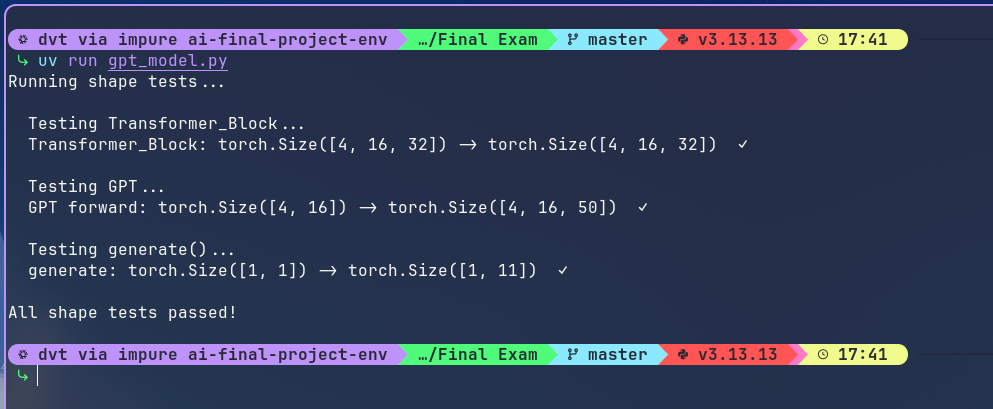
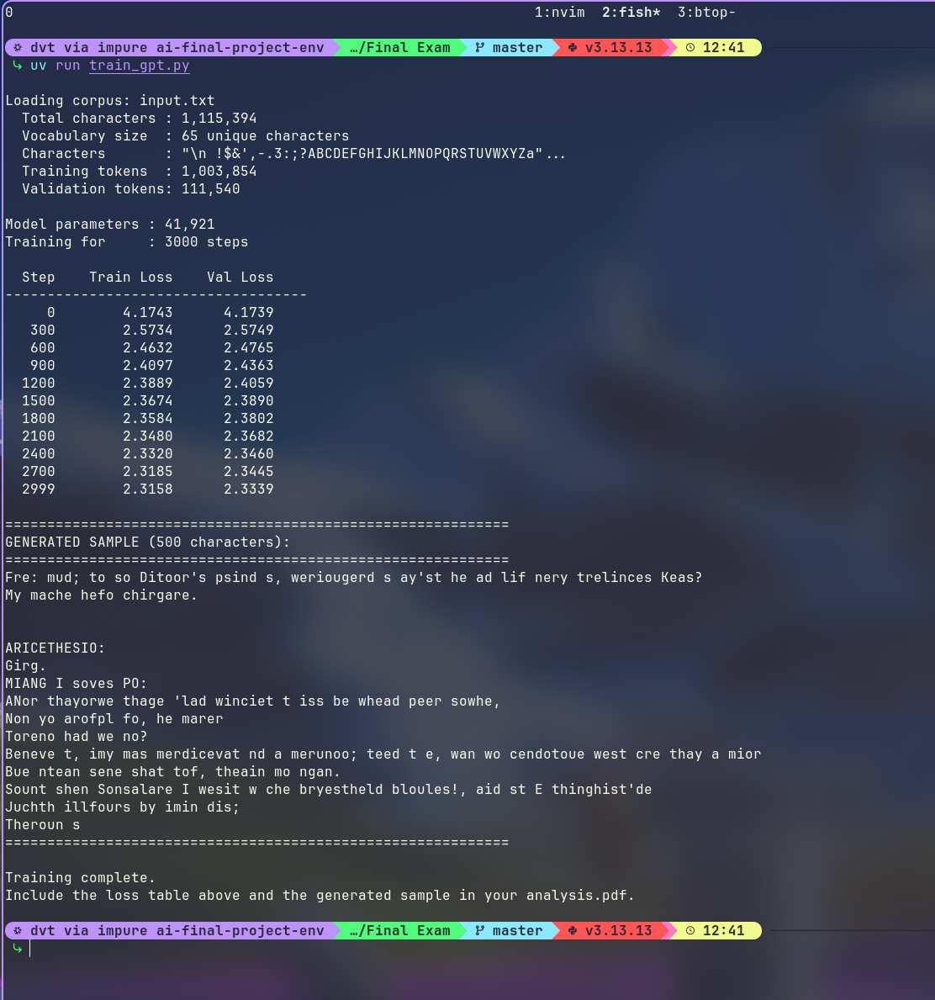
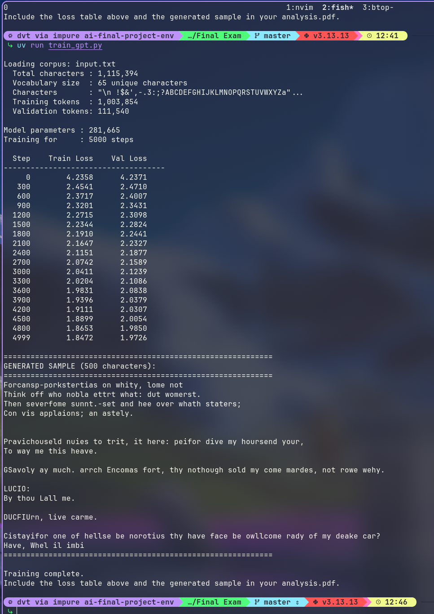
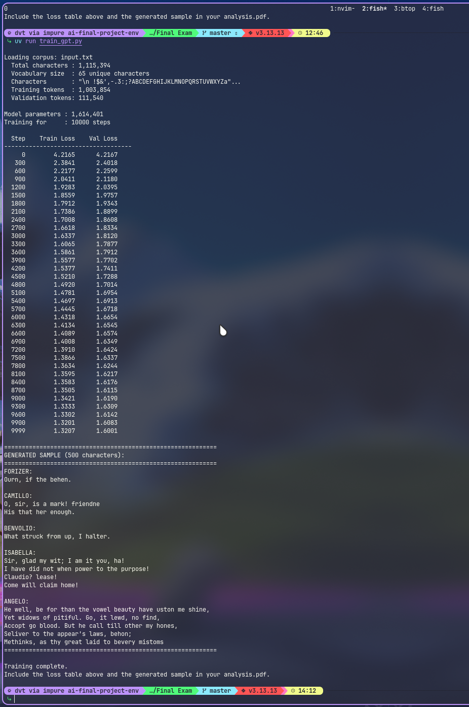

# AI Final Project

Yo use [uv](https://docs.astral.sh/uv) como mi manejador de Python. Para correr el programa debe instalar uv y setiar el ambiente con `uv sync`.

## Task 1


## Task 2



## Training

I used [Shakespeare's Complete Works](https://github.com/karpathy/char-rnn/blob/master/data/tinyshakespeare/input.txt) to train the model.
Three runs with different parameters were conducted, all with the same training dataset.
Increasing `N_LAYERS`, `LAYER_SIZE` and `MAX_ITERS` consistently
reduced both training and validation loss across all three runs.

### Run 1

Utilized `BLOCK_SIZE` and `LAYER_SIZE` of 64, `N_LAYERS` of 2, and `MAX_ITERS` of 3000.
After training, it produced near-random character sequences with occasional English fragments.



### Run 2

Utilized `BLOCK_SIZE` and `LAYER_SIZE` of 128, `N_LAYERS` of 4, and `MAX_ITERS` of 5000.
After training, it produced recognizable English words and rough dialogue structure.



### Run 3

Utilized `BLOCK_SIZE` and `LAYER_SIZE` of 256, `N_LAYERS` of 6, `MAX_ITERS` of 10000, and `BATCH_SIZE` of 64 instead of 32.
After training, it produced actual Shakespeare character names (i.e. Camillo, Isabella),
grammatically plausible sentences, and correct speaker-colon-newline dialogue formatting.



### Conclusion

Between runs the main trade-off is training time, which scaled non-linearly.
Run 1 took 19 seconds, run 2 took 2m 35s, and run 3 took 1h 22m.
This means that while parameter grew ~38x from run 1 to run 3,
training time grew ~260x.
This happens because each forward pass cost scales with both model depth (`N_LAYERS`)
and the quadratic attention computation over the longer `BLOCK_SIZE` compounding multiplicatively.

**Last 10 lines of training loss table (run 3):**

```
  7500        1.3866      1.6337
  7800        1.3634      1.6244
  8100        1.3595      1.6217
  8400        1.3583      1.6176
  8700        1.3505      1.6115
  9000        1.3421      1.6190
  9300        1.3333      1.6309
  9600        1.3302      1.6142
  9900        1.3201      1.6083
  9999        1.3207      1.6001
```

**Generated sample (run 3):**

```
FORIZER:
Ourn, if the behen.

CAMILLO:
O, sir, is a mark! friendne
His that her enough.

BENVOLIO:
What struck from up, I halter.

ISABELLA:
Sir, glad my wit; I am it you, ha!
I have did not when power to the purpose!
Claudio? lease!
Come will claim home!

ANGELO:
He well, be for than the vowel beauty have uston me shine,
Yet widows of pitiful. Go, it lewd, no find,
Accopt go blood. But he call till other my hones,
Seliver to the appear's laws, behon;
Methinks, as thy great laid to bevery mistoms

```
